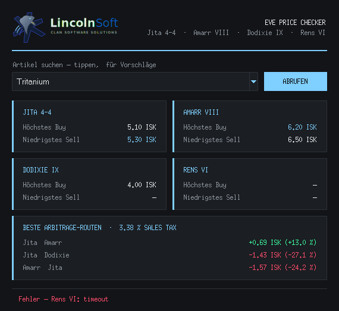

# EVE Price Checker

Kleines Desktop-Tool (Python/Tkinter) für **EVE Online**: zeigt für ein Item das höchste Buy und das niedrigste Sell an den vier großen Handelshubs und rechnet die besten Arbitrage-Routen zwischen ihnen aus, inklusive Sales Tax.



## Funktionen

- **Hubs:** Jita 4-4, Amarr VIII, Dodixie IX, Rens VI (nur Orders direkt an der Station zählen)
- **Item-Suche** mit Autovervollständigung: Treffer am Wortanfang zuerst, dann Teilstring-Treffer (max. 100 Vorschläge)
- **Bestwerte hervorgehoben:** höchstes Buy und niedrigstes Sell über alle Hubs
- **Top-3-Arbitrage-Routen:** Einkauf per Sell-Order an Hub A, Verkauf an Buy-Order in Hub B, abzüglich Sales Tax (Standard 3,375 % = Accounting V)
- **Item-Datenbank** (~ alle handelbaren Items) wird einmal über ESI aufgebaut und eine Woche lokal gecacht; schlägt das Update fehl, wird der alte Cache weiterverwendet
- Paralleles Abrufen aller Hubs, HTTP-Retries bei 502/503/504, ESI-Pagination
- Dunkles Theme, unter Windows 10/11 mit dunkler Titelleiste

## Download

Fertige exe: [Releases](https://github.com/markussauck-hub/eve-price-checker/releases/latest) → `EVE_Price_Checker.exe`

## Starten aus dem Quellcode

```bash
pip install -r requirements.txt
python eve_price_checker.py
```

Benötigt Python 3.10+ mit Tkinter (unter Windows im offiziellen Installer enthalten). Die Original-exe wurde mit Python 3.14 gebaut.

## exe bauen

```bat
build.bat
```

oder manuell:

```bash
pip install -r requirements.txt -r requirements-dev.txt
pyinstaller EVE_Price_Checker.spec
```

Ergebnis: `dist/EVE_Price_Checker.exe` (Onefile, ohne Konsolenfenster, mit LincolnSoft-Icon).

### GitHub Actions

Jeder Push auf `main` baut die exe auf `windows-latest` (Python 3.14), testet live gegen ESI (Tritanium an allen Hubs), startet GUI und exe probeweise und legt die exe als Artefakt ab.

Neues Release: *Actions → Build → Run workflow* mit Version, z. B. `v1.1.0`. Die exe landet dann unter Releases.

## Konfiguration

Oben in `eve_price_checker.py`:

| Konstante | Bedeutung | Standard |
|---|---|---|
| `SALES_TAX` | Sales Tax als Faktor (an Accounting-Skill anpassen) | `0.03375` |
| `STATIONS` | Hubs mit `station_id` / `region_id` | 4 Hubs |
| `ROUTES_SHOWN` | Anzahl angezeigter Arbitrage-Routen | `3` |
| `MAX_SUGGESTIONS` | Max. Einträge in der Vorschlagsliste | `100` |
| `CACHE_MAX_AGE` | Gültigkeit des Item-Caches in Sekunden | 1 Woche |
| `USER_AGENT` | User-Agent für ESI (bitte eigene Kontaktadresse eintragen) | Platzhalter |

Der Item-Cache liegt unter `%LOCALAPPDATA%\EVEPriceChecker\eve_items_cache.json` (auf anderen Systemen neben dem Skript).

## Projektstruktur

```
eve_price_checker.py     Anwendung (einzelnes Modul)
EVE_Price_Checker.spec   PyInstaller-Build
build.bat                Build-Skript für Windows
assets/
  icon.ico               exe-Icon
  logo_header.png        Header-Logo (im Code als Base64 eingebettet)
  logo_icon.png          Fenster-Icon (im Code als Base64 eingebettet)
docs/screenshot.png
```

## Herkunft

Der Quellcode wurde aus der kompilierten `EVE_Price_Checker.exe` rekonstruiert, nachdem das Originalprojekt verloren gegangen war. Programmlogik und Strings sind per Bytecode-Vergleich mit dem Original verifiziert (33 von 34 Code-Objekten identisch, die einzige Abweichung ist eine Zeilennummer). Kommentare und Docstrings in Funktionen sind beim Kompilieren verloren gegangen und wurden neu geschrieben.

---

LincolnSoft · Clan Software Solutions
